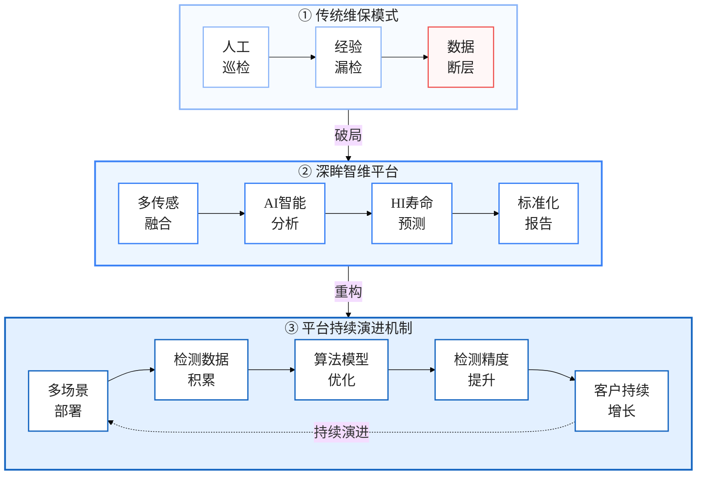

```mermaid
%%{init:{
"theme":"base",
"themeVariables":{
"fontFamily":"Microsoft YaHei",
"fontSize":"22px"
}
}}%%

flowchart TB

subgraph A["① 传统维保模式"]
direction LR
A1["人工<br/>巡检"] --> A2["经验<br/>漏检"]
A2 --> A3["数据<br/>断层"]
end

A -->|破局| B

subgraph B["② 深眸智维平台"]
direction LR
B1["多传感<br/>融合"] --> B2["AI智能<br/>分析"]
B2 --> B3["HI寿命<br/>预测"]
B3 --> B4["标准化<br/>报告"]
end

B -->|重构| C

subgraph C["③ 平台持续演进机制"]
direction LR
C1["多场景<br/>部署"] --> C2["检测数据<br/>积累"]
C2 --> C3["算法模型<br/>优化"]
C3 --> C4["检测精度<br/>提升"]
C4 --> C5["客户持续<br/>增长"]
C5 -.->|持续演进| C1
end


%% 一级模块
style A fill:#F7FBFF,stroke:#8AB4F8,stroke-width:2.5px,color:#222222
style B fill:#EDF6FF,stroke:#3B82F6,stroke-width:2.8px,color:#222222
style C fill:#E3F0FF,stroke:#1565C0,stroke-width:2.8px,color:#222222

%% 传统维保
style A1 fill:#FFFFFF,stroke:#8AB4F8,stroke-width:1.8px,color:#222222
style A2 fill:#FFFFFF,stroke:#8AB4F8,stroke-width:1.8px,color:#222222
style A3 fill:#FFF7F7,stroke:#EF5350,stroke-width:1.8px,color:#222222

%% 深眸智维
style B1 fill:#FFFFFF,stroke:#3B82F6,stroke-width:2px,color:#222222
style B2 fill:#FFFFFF,stroke:#3B82F6,stroke-width:2px,color:#222222
style B3 fill:#FFFFFF,stroke:#3B82F6,stroke-width:2px,color:#222222
style B4 fill:#FFFFFF,stroke:#3B82F6,stroke-width:2px,color:#222222

%% 数据飞轮
style C1 fill:#FFFFFF,stroke:#1565C0,stroke-width:2px,color:#222222
style C2 fill:#FFFFFF,stroke:#1565C0,stroke-width:2px,color:#222222
style C3 fill:#FFFFFF,stroke:#1565C0,stroke-width:2px,color:#222222
style C4 fill:#FFFFFF,stroke:#1565C0,stroke-width:2px,color:#222222
style C5 fill:#FFFFFF,stroke:#1565C0,stroke-width:2px,color:#222222
```