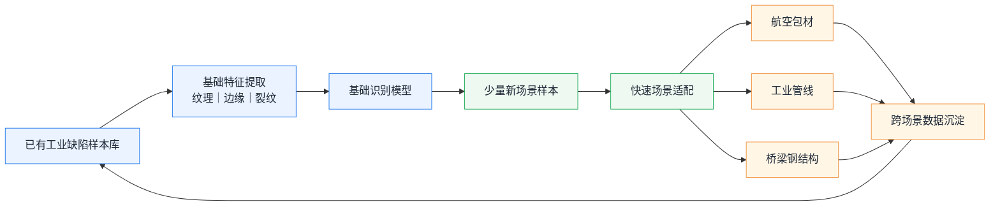

```mermaid
flowchart LR

A["已有工业缺陷样本库"]

A --> B["基础特征提取<br/>纹理｜边缘｜裂纹"]

B --> C["基础识别模型"]

C --> D["少量新场景样本"]

D --> E["快速场景适配"]

E --> F["航空包材"]
E --> G["工业管线"]
E --> H["桥梁钢结构"]

F --> I["跨场景数据沉淀"]
G --> I
H --> I

I --> A

classDef blue fill:#EAF3FF,stroke:#2F80ED,color:#1F2937;
classDef green fill:#EEF9F1,stroke:#27AE60,color:#1F2937;
classDef orange fill:#FFF6E6,stroke:#F2994A,color:#1F2937;

class A,B,C blue
class D,E green
class F,G,H,I orange
```