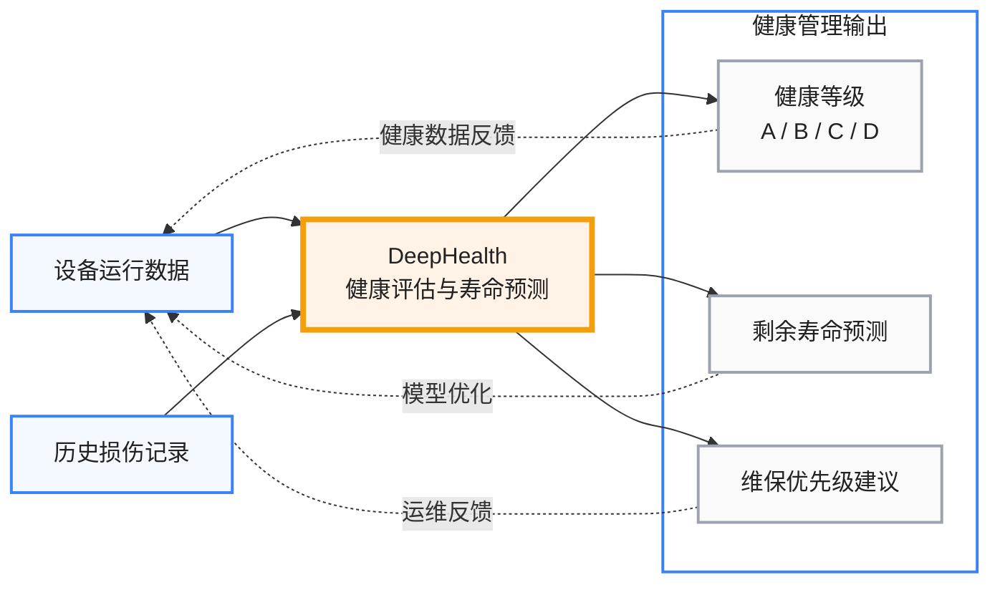

```mermaid
flowchart LR

A["设备运行数据"]
B["历史损伤记录"]

C["DeepHealth<br/>健康评估与寿命预测"]

subgraph D["健康管理输出"]
direction TB
D1["健康等级<br/>A / B / C / D"]
D2["剩余寿命预测"]
D3["维保优先级建议"]
end

A --> C
B --> C

C --> D1
C --> D2
C --> D3

D1 -. 健康数据反馈 .-> A
D2 -. 模型优化 .-> A
D3 -. 运维反馈 .-> A

style A fill:#F4F8FF,stroke:#3B82F6,stroke-width:2px,color:#222
style B fill:#F4F8FF,stroke:#3B82F6,stroke-width:2px,color:#222

style C fill:#FFF3E8,stroke:#F59E0B,stroke-width:4px,color:#222

style D1 fill:#FAFAFA,stroke:#9CA3AF,stroke-width:2px,color:#222
style D2 fill:#FAFAFA,stroke:#9CA3AF,stroke-width:2px,color:#222
style D3 fill:#FAFAFA,stroke:#9CA3AF,stroke-width:2px,color:#222

style D fill:#FFFFFF,stroke:#3B82F6,stroke-width:2px,color:#222
```