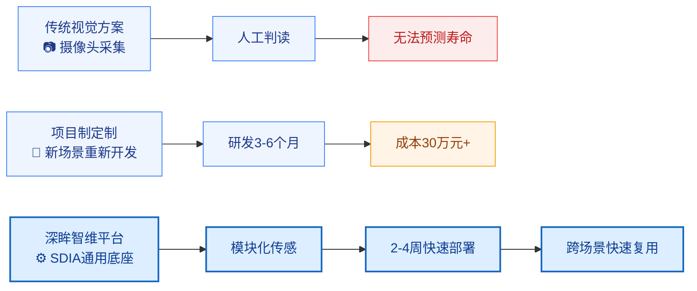

```mermaid
flowchart LR

A["传统视觉方案<br/>📷 摄像头采集"] --> B["人工判读"]
B --> C["无法预测寿命"]

D["项目制定制<br/>🔧 新场景重新开发"] --> E["研发3-6个月"]
E --> F["成本30万元+"]

G["深眸智维平台<br/>⚙ SDIA通用底座"] --> H["模块化传感"]
H --> I["2-4周快速部署"]
I --> J["跨场景快速复用"]

style A fill:#EEF5FF,stroke:#3B82F6,color:#1E3A8A
style B fill:#EEF5FF,stroke:#3B82F6,color:#1E3A8A
style C fill:#FDECEC,stroke:#EF4444,color:#B91C1C

style D fill:#EEF5FF,stroke:#3B82F6,color:#1E3A8A
style E fill:#EEF5FF,stroke:#3B82F6,color:#1E3A8A
style F fill:#FFF4E5,stroke:#F59E0B,color:#92400E

style G fill:#DCEEFF,stroke:#1565C0,stroke-width:2px,color:#0F3D91
style H fill:#DCEEFF,stroke:#1565C0,stroke-width:2px,color:#0F3D91
style I fill:#DCEEFF,stroke:#1565C0,stroke-width:2px,color:#0F3D91
style J fill:#DCEEFF,stroke:#1565C0,stroke-width:2px,color:#0F3D91
```