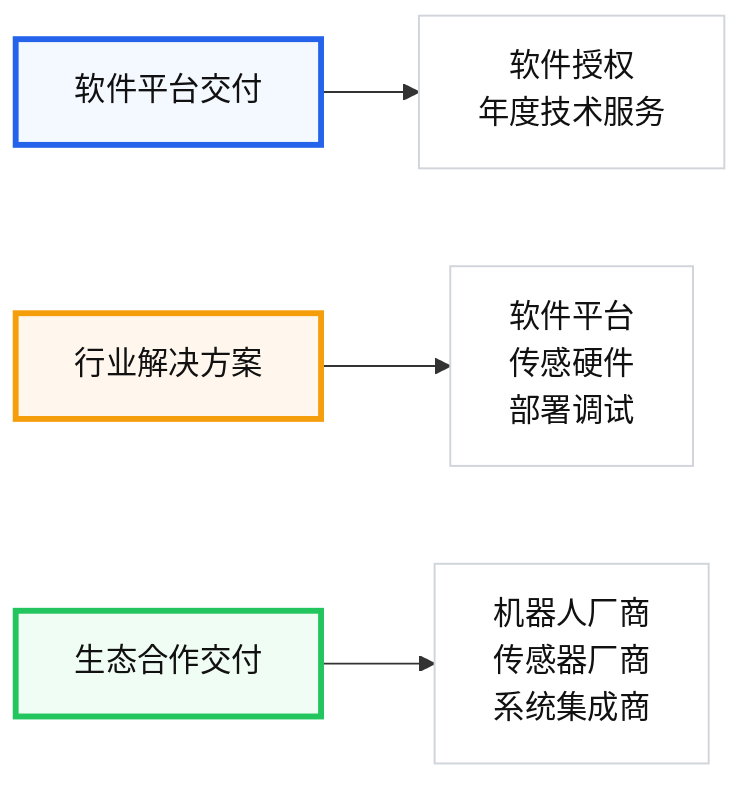

```mermaid
flowchart LR

A["软件平台交付"]
B["行业解决方案"]
C["生态合作交付"]

A --> D["软件授权<br/>年度技术服务"]

B --> E["软件平台<br/>传感硬件<br/>部署调试"]

C --> F["机器人厂商<br/>传感器厂商<br/>系统集成商"]

style A fill:#F4F8FF,stroke:#2563EB,stroke-width:3px,color:#111111
style B fill:#FFF7ED,stroke:#F59E0B,stroke-width:3px,color:#111111
style C fill:#F0FDF4,stroke:#22C55E,stroke-width:3px,color:#111111

style D fill:#FFFFFF,stroke:#D1D5DB,color:#111111
style E fill:#FFFFFF,stroke:#D1D5DB,color:#111111
style F fill:#FFFFFF,stroke:#D1D5DB,color:#111111
```