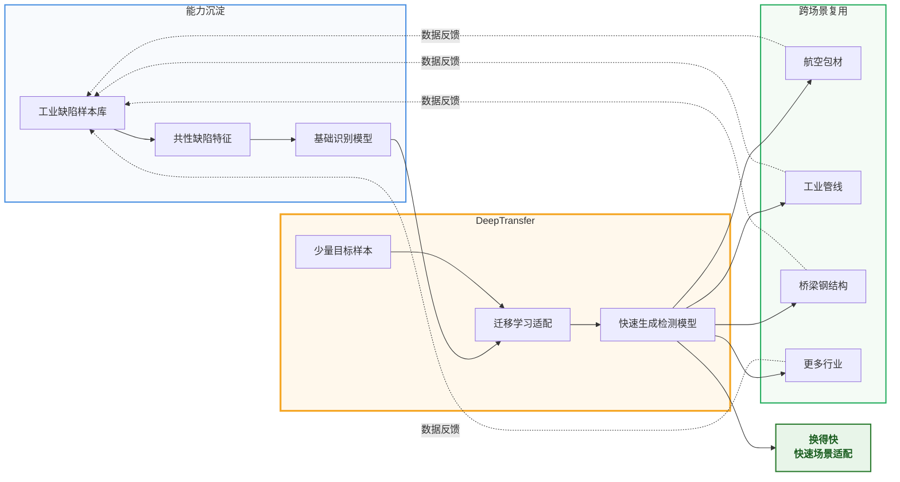

```mermaid
flowchart LR

subgraph L["能力沉淀"]
direction TB
A["工业缺陷样本库"]
B["共性缺陷特征"]
C["基础识别模型"]
A --> B --> C
end

subgraph M["DeepTransfer"]
direction TB
D["少量目标样本"]
E["迁移学习适配"]
F["快速生成检测模型"]
C --> E
D --> E
E --> F
end

subgraph R["跨场景复用"]
direction TB
G["航空包材"]
H["工业管线"]
I["桥梁钢结构"]
J["更多行业"]
end

F --> G
F --> H
F --> I
F --> J

G -.数据反馈.-> A
H -.数据反馈.-> A
I -.数据反馈.-> A
J -.数据反馈.-> A

K["换得快\n快速场景适配"]:::value
F --> K

classDef value fill:#E8F5E9,stroke:#2E7D32,stroke-width:2px,color:#1B5E20,font-weight:bold;

style L fill:#F8FAFD,stroke:#4A90E2,stroke-width:2px
style M fill:#FFF8EC,stroke:#F5A623,stroke-width:3px
style R fill:#F4FBF5,stroke:#27AE60,stroke-width:2px
```