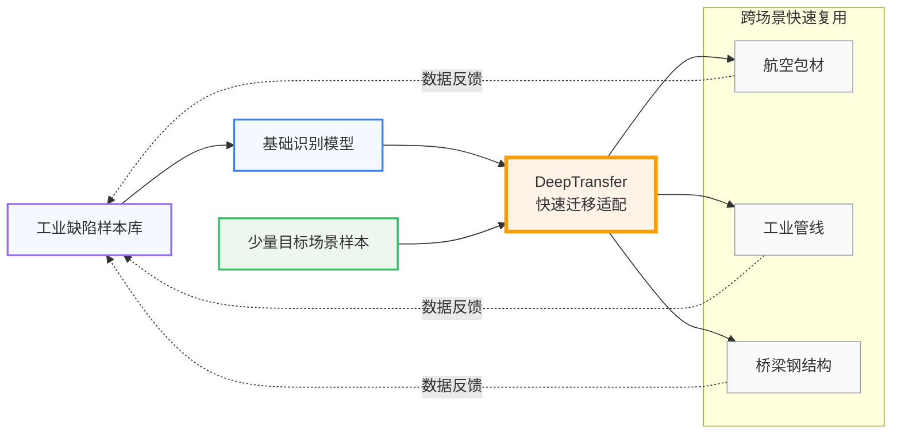

```mermaid
flowchart LR

A["工业缺陷样本库"]
B["基础识别模型"]
C["DeepTransfer<br/>快速迁移适配"]
D["少量目标场景样本"]

subgraph E["跨场景快速复用"]
direction TB
E1["航空包材"]
E2["工业管线"]
E3["桥梁钢结构"]
end

A --> B
B --> C
D --> C

C --> E1
C --> E2
C --> E3

E1 -. 数据反馈 .-> A
E2 -. 数据反馈 .-> A
E3 -. 数据反馈 .-> A

style A fill:#F4F8FF,stroke:#B82F6,stroke-width:2px
style B fill:#F4F8FF,stroke:#3B82F6,stroke-width:2px

style C fill:#FFF3E8,stroke:#F59E0B,stroke-width:4px

style D fill:#EEF7EE,stroke:#22C55E,stroke-width:2px

style E1 fill:#FAFAFA,stroke:#9CA3AF
style E2 fill:#FAFAFA,stroke:#9CA3AF
style E3 fill:#FAFAFA,stroke:#9CA3AF
```