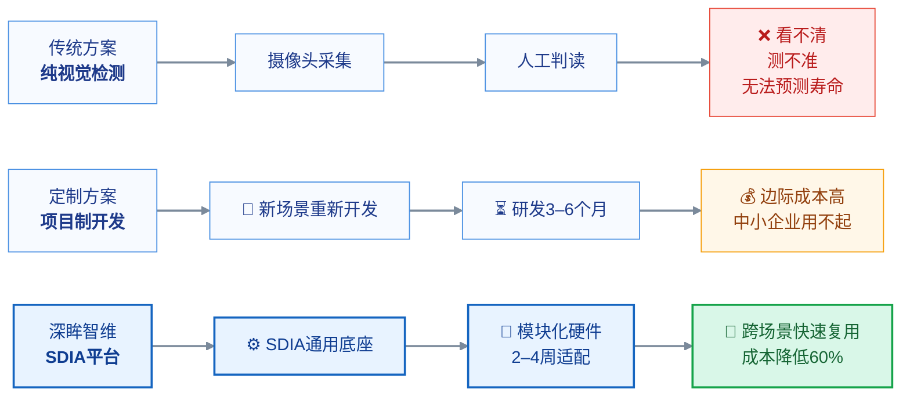

```mermaid
flowchart LR

%% ================= 第一行 =================
A["传统方案<br/><b>纯视觉检测</b>"]
--> B["摄像头采集"]
--> C["人工判读"]
--> D["❌ 看不清<br/>测不准<br/>无法预测寿命"]

%% ================= 第二行 =================
E["定制方案<br/><b>项目制开发</b>"]
--> F["🔧 新场景重新开发"]
--> G["⏳ 研发3–6个月"]
--> H["💰 边际成本高<br/>中小企业用不起"]

%% ================= 第三行 =================
I["深眸智维<br/><b>SDIA平台</b>"]
--> J["⚙ SDIA通用底座"]
--> K["🧩 模块化硬件<br/>2–4周适配"]
--> L["🚀 跨场景快速复用<br/>成本降低60%"]

%% ================= 配色 =================
style A fill:#F7FAFF,stroke:#4A90E2,color:#1E3A8A
style B fill:#F7FAFF,stroke:#4A90E2,color:#1E3A8A
style C fill:#F7FAFF,stroke:#4A90E2,color:#1E3A8A
style D fill:#FFECEC,stroke:#E74C3C,color:#B91C1C

style E fill:#F7FAFF,stroke:#4A90E2,color:#1E3A8A
style F fill:#F7FAFF,stroke:#4A90E2,color:#1E3A8A
style G fill:#F7FAFF,stroke:#4A90E2,color:#1E3A8A
style H fill:#FFF7E8,stroke:#F59E0B,color:#92400E

style I fill:#E8F3FF,stroke:#1565C0,stroke-width:2px,color:#0F3D91
style J fill:#E8F3FF,stroke:#1565C0,stroke-width:2px,color:#0F3D91
style K fill:#E8F3FF,stroke:#1565C0,stroke-width:2px,color:#0F3D91
style L fill:#D9F7E8,stroke:#16A34A,stroke-width:2px,color:#166534

linkStyle default stroke:#7B8A9B,stroke-width:2px
```