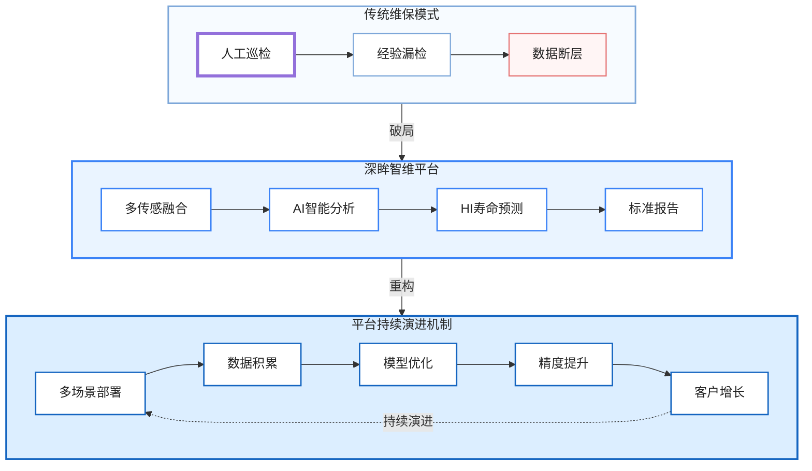

```mermaid
flowchart TB

subgraph A["传统维保模式"]
direction LR
A1["人工巡检"] --> A2["经验漏检"]
A2 --> A3["数据断层"]
end

A -->|破局| B

subgraph B["深眸智维平台"]
direction LR
B1["多传感融合"] --> B2["AI智能分析"]
B2 --> B3["HI寿命预测"]
B3 --> B4["标准报告"]
end

B -->|重构| C

subgraph C["平台持续演进机制"]
direction LR
C1["多场景部署"] --> C2["数据积累"]
C2 --> C3["模型优化"]
C3 --> C4["精度提升"]
C4 --> C5["客户增长"]
C5 -.->|"持续演进"| C1
end


%% =======================
%% 一级模块（标题框）
%% =======================

style A fill:#F7FBFF,stroke:#7DA7D9,stroke-width:2px,color:#222222
style B fill:#EAF4FF,stroke:#3B82F6,stroke-width:2.5px,color:#222222
style C fill:#DCEEFF,stroke:#1565C0,stroke-width:2.5px,color:#222222

%% =======================
%% 传统维保
%% =======================

style A1 fill:#FFFFFF,stroke:#55DA7D9,stroke-width:4px,color:#222222
style A2 fill:#FFFFFF,stroke:#7DA7D9,stroke-width:1.5px,color:#222222
style A3 fill:#FFF5F5,stroke:#E57373,stroke-width:1.5px,color:#222222

%% =======================
%% 深眸智维
%% =======================

style B1 fill:#FFFFFF,stroke:#3B82F6,stroke-width:1.8px,color:#222222
style B2 fill:#FFFFFF,stroke:#3B82F6,stroke-width:1.8px,color:#222222
style B3 fill:#FFFFFF,stroke:#3B82F6,stroke-width:1.8px,color:#222222
style B4 fill:#FFFFFF,stroke:#3B82F6,stroke-width:1.8px,color:#222222

%% =======================
%% 平台演进
%% =======================

style C1 fill:#FFFFFF,stroke:#1565C0,stroke-width:1.8px,color:#222222
style C2 fill:#FFFFFF,stroke:#1565C0,stroke-width:1.8px,color:#222222
style C3 fill:#FFFFFF,stroke:#1565C0,stroke-width:1.8px,color:#222222
style C4 fill:#FFFFFF,stroke:#1565C0,stroke-width:1.8px,color:#222222
style C5 fill:#FFFFFF,stroke:#1565C0,stroke-width:1.8px,color:#222222
```