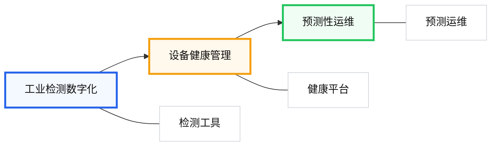

```mermaid
flowchart LR

A["工业检测数字化"]
B["设备健康管理"]
C["预测性运维"]

A --> B --> C

T1["检测工具"]
T2["健康平台"]
T3["预测运维"]

A --- T1
B --- T2
C --- T3

style A fill:#F4F8FF,stroke:#2563EB,stroke-width:3px,color:#111111
style B fill:#FFF8EC,stroke:#F59E0B,stroke-width:3px,color:#111111
style C fill:#F0FDF4,stroke:#22C55E,stroke-width:3px,color:#111111

style T1 fill:#FFFFFF,stroke:#D1D5DB,color:#111111
style T2 fill:#FFFFFF,stroke:#D1D5DB,color:#111111
style T3 fill:#FFFFFF,stroke:#D1D5DB,color:#111111
```